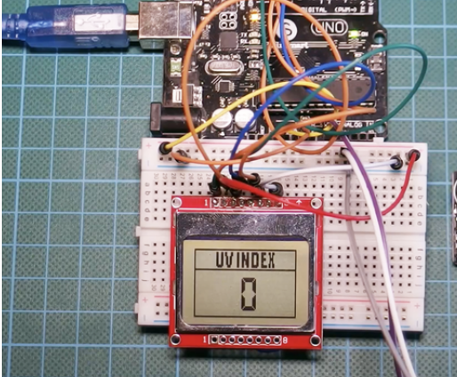

 Hi there I'm

<h3 align="center">
</h3>

<h3>Summary:</h3>
Hello, welcome to my portfolio. In this site I have compiled my experience, projects,  and education to give a summary of myself. I am planning to use this portfolio to market myself to prospective employers and to give out when connecting or networking with other people. 

<h3>🔎 About me :</h3>

I am a Georgia native that graduated from Tucker High School. I’ve spent my entire life living in Georgia. I have attended 3 major colleges within the metro Atlanta area and I am proud to represent them all. I am an aspiring machine learning engineer who chose my journey when I started college. I was initially intimidated by math courses but after being tasked with completing a math course to study business marketing (my original college major) I realized this was a task that would never go away. I worked as hard as I possibly could to study and cover the content for this math course(college algebra) and eventually I realized that math is not all that bad. After completing my first semester I asked my math professor to write a recommendation letter for me to receive a scholarship. He agreed but he wondered why I didn’t choose engineering as my major. I told him about how I felt about math and he revealed that I topped my class for overall grades and the final exam. I didn’t miss a single question. Before this, I always believed that I wasn’t capable of learning technical topics especially anything relevant to math. But after this meeting I was inspired to see myself for more than what I’d previously known. I decided to pursue engineering as my major. From there I graduated GSU-PC with an AS in Engineering and from Spelman College with a BS in Computer Science. I am now attending GA Tech to receive my BS in Computer Engineering.

- 👩🏾‍💻 I’m currently working on ***[school & personal projects](https://replit.com/@alanasalgorithm)***
- 🌱 I’m currently learning **about prospective Software &| ML roles in my city 😤**
- 💬 Ask me about **[my glow up! 🌟](https://www.instagram.com/glowupwithalana/)**
- 😍 I love skin care, AI, and everything self care 
- ⚡ Fun fact: I'm a Healthcare Technology Start-up founder and I started my business in 2022
- 📫 Reach me ***[through email](mailto:aburrell7@gatech.edu)***
- ☕️ Buy me a ***[coffee](https://www.buymeacoffee.com/alanasalgorithm)***
- 

<h3> My Career Goals :</h3>
In the next five years, my primary career goal is to establish myself as a proficient machine learning engineer or a data science specialist, ideally working remotely or based in Atlanta, though I am flexible about traveling for the right opportunities. Having pursued my education at Georgia Tech, I am on track to complete two degrees that are crucial stepping stones toward this goal. In terms of financial planning, I am mindful of the costs associated with my academic pursuits, which I project to be around $50,000, including tuition and necessary resources.

To enhance my candidacy and expertise further, I plan to achieve at least two additional certifications in areas like AI and big data analytics, which I estimate will cost an additional $5,000. My strategic actions to transition effectively into my desired career include: 1) securing internships with leading tech firms to gain practical, hands-on experience; 2) attending industry conferences and networking events to connect with professionals and thought leaders in the field; and 3) consistently contributing to open-source projects to build a robust portfolio that demonstrates my skills and commitment to continuous learning. These steps will ensure that I not only meet but exceed the expectations of potential employers in the rapidly evolving tech landscape.

<h3>My Projects:</h3>
<h3>Sign Language Recognition using Transfer Learning and Auto Augmentation</h3>
   <!-- Sign Language Recognition using Transfer Learning and Auto Augmentation -->
   
   <h3>Brain Tumor Image Segmentation </h3>
      <!-- Brain Tumor Image Segmentation -->
   
    <h3>Automatic Window Opener </h3>
      <!-- Automatic Window Opener -->
   
    <h3>MBED Video Game </h3>
      <!-- MBED Video Game -->
   
    <h3>Utilizing Deep Learning to Close the Gap in Dermatologic Health Disparities </h3>
      <!-- Utilizing Deep Learning to Close the Gap in Dermatologic Health Disparities -->
   
   <h3>Developing a UV Index Meter to Measure Solar Intensity </h3>
      <!-- Developing a UV Index Meter to Measure Solar Intensity -->
   

<h3> My Resume :</h3>
   

<h3>🤝 Connect with me :</h3>

  
  
  
   
   <a href="linkedin.com/in/alanasalgorithms" rel="nofollow">
<!--      -->
  </a>

<h3>🛠 My TechStack :</h3>

  <!-- Shapr3D -->
     
  <!-- Unity -->
     
   <!-- Vs Code -->
   </a>
  <!-- Replit -->
    
   <!-- CSS -->
   
   <!-- Arduino -->
   
   <!-- Python -->
   
   <!-- JavaScript -->
   
   <!-- Html -->
   
   <!-- Git -->
   
   <!-- Visual Studio -->
   

<!--
**alanasalgorithms/alanasalgorithms** is a ✨ _special_ ✨ repository because its `README.md` (this file) appears on your GitHub profile.

Here are some ideas to get you started:

- 🔭 I’m currently working on ...
- 🌱 I’m currently learning ...
- 👯 I’m looking to collaborate on ...
- 🤔 I’m looking for help with ...
- 💬 Ask me about ...
- 📫 How to reach me: ...
- 😄 Pronouns: ...
- ⚡ Fun fact: ...
-->
